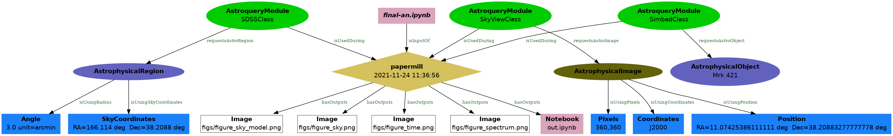

# renku-aqs

##`params`
```bash
$ (cd renku-aqs-test-case/; renku aqs params)
+--------------------------------------+-------------------+--------------+
| Run ID                               | AstroQuery Module | Astro Object |
+--------------------------------------+-------------------+--------------+
| d99fd828-6d03-48a3-bfeb-26714ee19a7d |    SimbadClass    |   Mrk 421    |
+--------------------------------------+-------------------+--------------+ 

+--------------------------------------+-------------------+-------------------------+
| Run ID                               | AstroQuery Module |       Astro Region      |
+--------------------------------------+-------------------+-------------------------+
| d99fd828-6d03-48a3-bfeb-26714ee19a7d |     SDSSClass     | 3arcmin 166.114 38.2088 |
+--------------------------------------+-------------------+-------------------------+ 

+--------------------------------------+-------------------+------------------------------------------+
| Run ID                               | AstroQuery Module |               Astro Image                |
+--------------------------------------+-------------------+------------------------------------------+
| da34b8fd-8000-4c39-9634-173e67a6b923 |    SkyViewClass   | 11 04 27.3139,+38 12 31.798J2000_360,360 |
+--------------------------------------+-------------------+------------------------------------------+ 
```
##`display`

CLI command to generate an output graph in an output png image

###parameters

* `--filename` The filename of the output file image, until now, only png images are supported (eg `--filename graph.png`), default is `graph.png`
* `--input-notebook` Input notebook to process, if not specified, will query for all the executions from all notebooks  
* `--no-oda-info` Exclude oda related information in the output graph, an output much closer to the lineage graph provided in the renkulab will be generated
```bash
$ (cd renku-aqs-test-case/; renku aqs display)
 ```


