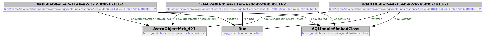

# Collecting metadata with the plugin, inspecting it


```bash
$ (cd renku-aqs-test-case/; renku aqs params)
+--------------------------------------+-------------------+--------------+
| Run ID                               | AstroQuery Module | Astro Object |
+--------------------------------------+-------------------+--------------+
| 228555e4-151a-4440-919d-f1269132a0fb |    SimbadClass    |   Mrk 421    |
| 76943a72-30bf-4e9e-ad92-3dd068424968 |    SimbadClass    |   Mrk 421    |
| 0320ea0d-eee2-4b50-aa3e-b64c557b9bf2 |    SimbadClass    |   Mrk 421    |
+--------------------------------------+-------------------+--------------+
@prefix local-renku: <file:///home/savchenk/work/oda/renku/renku-aqs/renku-aqs-test-case/.renku/> .
@prefix oda: <http://odahub.io/ontology#> .
@prefix odas: <https://odahub.io/ontology#> .

local-renku:4ab60eb4-d5e7-11eb-a2dc-b5ff8b3b1162 a oda:Run ;
    oda:isRequestingAstroObject odas:AstroObjectMrk_421 ;
    oda:isUsing odas:AQModuleSimbadClass .

local-renku:53e67e80-d5ea-11eb-a2dc-b5ff8b3b1162 a oda:Run ;
    oda:isRequestingAstroObject odas:AstroObjectMrk_421 ;
    oda:isUsing odas:AQModuleSimbadClass .

local-renku:dd481450-d5e4-11eb-a2dc-b5ff8b3b1162 a oda:Run ;
    oda:isRequestingAstroObject odas:AstroObjectMrk_421 ;
    oda:isUsing odas:AQModuleSimbadClass .
 ```





## Sharing the metadata with the larger world

Pushing metadata to upstream, e.g. file:

```bash
$ renku aqs kg -u file:///tmp/rdf.ttl push
```

Or default SPARQL endpoint:

```bash
$ renku aqs kg push
```

## Find suggestions for your workflow


Ignoring "now" (i.e. not associating it to the focus node and hence using it in computing distances):


```
$ renku aqs kg suggest  --max-entries 100 --filter-input-value 421 --explain --ignore-now --plot

traced:
    oda:Focus                                             1.00000  http://odahub.io/ontology#Focus
    oda:relatedTo                                         0.00000  http://odahub.io/ontology#relatedTo
    <http://github.com/oda-hub/oda-sdss/>                 1.00000  http://github.com/oda-hub/oda-sdss/
    oda:has_runs_with_astro_object                        1.00000  http://odahub.io/ontology#has_runs_with_astro_object
    oda:AstroObjectMrk_421                                1.00000  http://odahub.io/ontology#AstroObjectMrk_421
    oda:has_input_source_name_inverse                     1.00000  http://odahub.io/ontology#has_input_source_name_inverse
    <http://github.com/oda-hub/oda-sdss//Plan>            1.00000  http://github.com/oda-hub/oda-sdss//Plan
trace distance: 6

total distance: 3.428571428571429
total distance: 3.428571428571429 http://odahub.io/ontology#AstroObjectMrk_421
+-------------------------------------+----------------------------------------------+--------------------+
|               Workflow              |                    Inputs                    |      Distance      |
+-------------------------------------+----------------------------------------------+--------------------+
| http://github.com/oda-hub/oda-sdss/ |     http://odahub.io/ontology#GRB210421C     | 3.7333333333333334 |
| http://github.com/oda-hub/oda-sdss/ |     http://odahub.io/ontology#GRB210421A     | 3.7333333333333334 |
| http://github.com/oda-hub/oda-sdss/ | http://odahub.io/ontology#AstroObjectMrk_421 | 3.428571428571429  |
+-------------------------------------+----------------------------------------------+--------------------+
```


```bash

$ renku aqs kg suggest  --max-entries 100 --filter-input-value 421 --plot```

+-------------------------------------+----------------------------------------------+--------------------+
|               Workflow              |                    Inputs                    |      Distance      |
+-------------------------------------+----------------------------------------------+--------------------+
| http://github.com/oda-hub/oda-sdss/ | http://odahub.io/ontology#AstroObjectMrk_421 | 3.428571428571429  |
| http://github.com/oda-hub/oda-sdss/ |     http://odahub.io/ontology#GRB210421A     | 2.4317929154938036 |
| http://github.com/oda-hub/oda-sdss/ |     http://odahub.io/ontology#GRB210421C     | 2.431026469780614  |

```


Notice how `Mrk 421` now less favorable. It is because GRBs are recent, and relate to current moment.


## Sources of ontology

TODO:
* runs of renku
* cc workflow
* MM INTEGRAL wfl
* mm events, grs
* qla

* mmoda requests
* astroquery in github (or other public locations), plenty of [options](https://github.com/search?q=astroquery+in%3Afile+extension%3Aipynb), let's leverage our committment  to astroquery, [see also](harvesting-public-sources.md)


## Using IVOA Astro Object ontology

This example shows how object ontology connects sources which are related. Source names and workflows collected from cross-calibration test collection [ref](...).


in cc-v0332

```bash
$ renku aqs kg suggest --filter-input-values '^(?!.*GRB20).*$' --max-options 1500 --learn-inputs --explain  --ignore-now
...
| http://gitlab.astro.unige.ch/integral/cc-workflows/cc-v0332.git |     http://odahub.io/ontology#GRB210101A     | 12.68031496062992 |
| http://gitlab.astro.unige.ch/integral/cc-workflows/cc-v0332.git |     http://odahub.io/ontology#GRB080102A     | 12.68031496062992 |
| http://gitlab.astro.unige.ch/integral/cc-workflows/cc-v0332.git |     http://odahub.io/ontology#GRB080101A     | 12.68031496062992 |
| http://gitlab.astro.unige.ch/integral/cc-workflows/cc-v0332.git | http://odahub.io/ontology#AstroObjectMrk_421 | 12.68031496062992 |
| http://gitlab.astro.unige.ch/integral/cc-workflows/cc-v0332.git |    http://odahub.io/ontology/values#HerX1    |  7.38715063802749 |
| http://gitlab.astro.unige.ch/integral/cc-workflows/cc-v0332.git |    http://odahub.io/ontology/values#CygX1    | 5.013123617596461 |
| http://gitlab.astro.unige.ch/integral/cc-workflows/cc-v0332.git | http://odahub.io/ontology/values#EXO0331530  | 4.421476510067114 |
+-----------------------------------------------------------------+----------------------------------------------+-------------------+
```


* EXO0331530 which is already used in the workflow - just a cross-check
* Cyg X-1 is the best new suggestion, since it's also an HXMB. 
* Her X-1 is an LXMB, so it shares a mid-level class (so, an additional long link) with Cyg X-1. 
* Still better than Mrk 421 which is an AGN.

