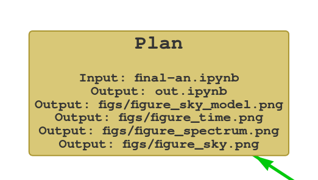

# renku-aqs

## `params`
```bash
$ (cd renku-aqs-test-case/; renku aqs params)
+--------------------------------------+-------------------+--------------+
| Run ID                               | AstroQuery Module | Astro Object |
+--------------------------------------+-------------------+--------------+
| 228555e4-151a-4440-919d-f1269132a0fb |    SimbadClass    |   Mrk 421    |
| 76943a72-30bf-4e9e-ad92-3dd068424968 |    SimbadClass    |   Mrk 421    |
| 0320ea0d-eee2-4b50-aa3e-b64c557b9bf2 |    SimbadClass    |   Mrk 421    |
+--------------------------------------+-------------------+--------------+
@prefix local-renku: <file:///home/savchenk/work/oda/renku/renku-aqs/renku-aqs-test-case/.renku/> .
@prefix oda: <http://odahub.io/ontology#> .
@prefix odas: <https://odahub.io/ontology#> .

local-renku:4ab60eb4-d5e7-11eb-a2dc-b5ff8b3b1162 a oda:Run ;
    oda:isRequestingAstroObject odas:AstroObjectMrk_421 ;
    oda:isUsing odas:AQModuleSimbadClass .

local-renku:53e67e80-d5ea-11eb-a2dc-b5ff8b3b1162 a oda:Run ;
    oda:isRequestingAstroObject odas:AstroObjectMrk_421 ;
    oda:isUsing odas:AQModuleSimbadClass .

local-renku:dd481450-d5e4-11eb-a2dc-b5ff8b3b1162 a oda:Run ;
    oda:isRequestingAstroObject odas:AstroObjectMrk_421 ;
    oda:isUsing odas:AQModuleSimbadClass .
  ```


# Graphical visualization of the graph
Starting from the knowledge graph generated and enriched during the various executions of the notebooks present within 
the repository, this is queried to retrieve the needed information, perform some inferring and generate a graphical 
representation.

In particular, two commands are provided:
* `display` to generate a representation of the graph over an output image
* `show-graph` to start an interactive visualization of the graph over the browser 

## `display` command

CLI command to generate a graphical representation of the graph over an image.

In particular, the following information are elaborated:
* inputs/arguments/outputs of the notebook execution;
* [astroquery](https://github.com/oda-hub/astroquery/) modules used and the main query methods called ([astroquery api](https://github.com/astropy/astroquery/blob/main/docs/api.rst)).

#### Parameters

* `--filename` The filename of the output file image, until now, only png images are supported (eg `--filename graph.png`), default is `graph.png`
* `--input-notebook` Input notebook to process, if not specified, will query for all the executions from all notebooks  
* `--no-oda-info` Exclude oda related information in the output graph, an output much closer to the lineage graph provided in the renkulab will be generated
```bash
$ renku aqs display
 ```


#### Specify executed notebook
```bash
$ renku aqs display --input-notebook final-an.ipynb
 ```


#### Do not display oda-related information
```bash
$ renku aqs display --input-notebook final-an.ipynb --no-oda-info
 ```


## `show-graph` command

CLI command to generate an interactive graphical representation of the graph.

```bash
$ renku aqs show-graph
 ```


The user can interact with the graph via a single click on one of its nodes: upon clicking, 
a `SPARQL` query is dynamically built, and this will retrieve all the nodes and edges directly connected to the clicked 
node, as shown in the animation below. Once the node has been expanded, the newly added nodes, along 
with the other leaves nodes that are connected to the previously clicked node, can be re-absorbed 
by clicking again on the very same node. This is also visible in the animation below.

<div align="center">

</div>
<br clear="left"/>

The interface provides the user with a number of adjustable options:

* **Change graph layout**: Two possible layouts are at the moment supported
  * _random_: where nodes and edges are displayed in a random fashion over the dedicated frame 
  (this layout is used in the above picture)
  * _hierarchical_: where a hierarchical visualization is applied to the nodes and the edges, an example of 
  this is displayed in the image below
  <div align="center">
  
  </div>
  
* **Enable/disable selection of subsets of nodes**: filtering of certain subset of nodes (eg astroquery-related nodes).
This is configurable via a dedicated json file.
* **Apply reductions on the graph**: allows to enable the display of certain nodes with the relative child ones 
absorbed within, and viceversa (eg in the example images, the `Plan` node has a number of child nodes, those
can be visualized inside the `Plan`, left image, as well as regular ones, right image) 
This is configurable via a dedicated json file.
<div align="center">


</div>
<br clear="left"/>

* **Enable/disable graphical configurations for the graph**: enable/disable a set of graphical configurations for
the graph (nodes and edges), where each configuration is loaded from a dedicated json file. In the image displayed below,
two json files have been loaded, and the related checkbox will enable/disable that configuration.
<div align="center">

</div>


The functionalities for the graph drawing and its behavior are developed in javascript and are avaialble
at the following [repository](https://github.com/oda-hub/renku-aqs-graph-library/).


# Installation of the plugin

Currently, the plugin is developed using the version `2.2.0` of [renku-python](https://github.com/SwissDataScienceCenter/renku-python). Please make sure such version is installed by running:

```bash
renku --version
```

The versioning of the dependency is guaranteed during the installation of the plugin, and in addition a dedicated check will be performed during the import.

For the installation of the plugin via `pip`:
<!---
TODO installation from the github repo, will be distributed ?
--->
```bash
pip install renku_aqs
```
